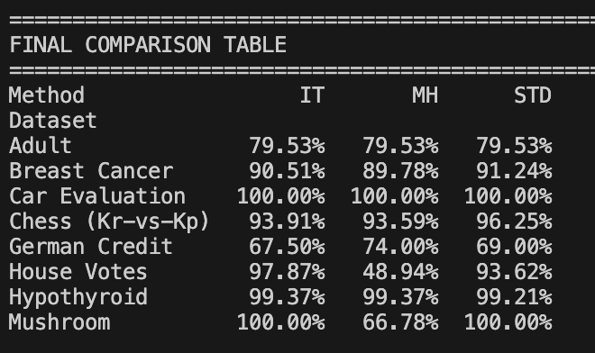

## **Causal Decision Trees using causal entropy and causal info gain:**

This project implements a comparative framework for **Causal Decision Trees (CDT)** versus **Standard Decision Trees (SDT)** to analyze causal relationships in data. It features two custom causal split criteria: one based on **Causal Information Theory** (using causal entropy and gain) and another using the **Mantel-Haenszel statistic** for significance testing. The system includes a robust data preprocessing pipeline that standardizes eight diverse UCI machine learning datasets (e.g., Adult, German Credit, Hypothyroid) into binary formats suitable for causal inference. An automated runner script iterates through all configured datasets, training models using Information Theory, Mantel-Haenszel, and Standard Entropy methods side-by-side. The final output is an aggregated performance table that benchmarks the classification accuracy of causal discovery algorithms against traditional machine learning approaches.

## **How to Run?**
Get the Python env setup with the basics installation needed. If not present already.

    python3 main.py

## **More Info:**
- Core Algorithm LogicBinary Target Requirement: The target attribute is strictly treated as binary (0 or 1). This is essential to define clear "treatment" versus "control" groups, enabling the calculation of causal effects (like Average Causal Effect) used to determine split points.
- Recursive Splitting Process:
   - Selection Loop: Starting with $N$ potential predictor attributes, the algorithm iterates through each one to evaluate its quality as a split node.
   - Stratification: For each candidate attribute, the algorithm identifies relevant covariates (confounders) and stratifies the data to control for them, ensuring that the split reflects a causal relationship rather than a spurious correlation.
   - Maximization: It calculates a specific statistic for each attribute (e.g., the PAMCH statistic for Mantel-Haenszel). The attribute yielding the maximum value is chosen as the split node.
- Termination: The recursion stops when the calculated statistic falls below a critical threshold (e.g., a Chi-squared significance level), at which point the node is finalized as a leaf.
- Architectural Design
    - Abstract Base Class: To support different causal metrics without rewriting the tree logic, the system uses an Abstract Base Class (ABC) named BaseCausalDecisionTree. This class handles the common infrastructure: recursion, tree storage, prediction, and pruning.
    - Polymorphic Implementation: The specific splitting logic is isolated in an abstract method _find_best_split. Concrete subclasses implement this method differently:
        - Mantel-Haenszel Class: Inherits from the base and implements the split using the PAMCH statistic (MantelHaenszelCDT).
        - Information Theory Class: Inherits from the base and implements the split using Causal Entropy and Causal Information Gain (InformationTheoryCDT).
    -Benefit: This Object-Oriented approach allows the main runner to treat all models uniformly while swapping out the mathematical "engine" (PAMCH vs. Entropy) seamlessly.

## **Output:** 
